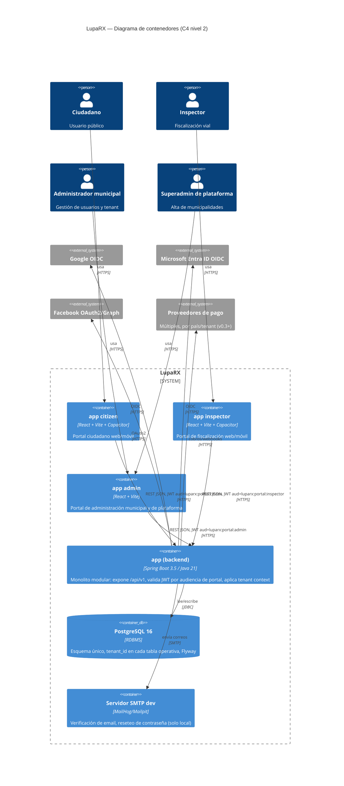
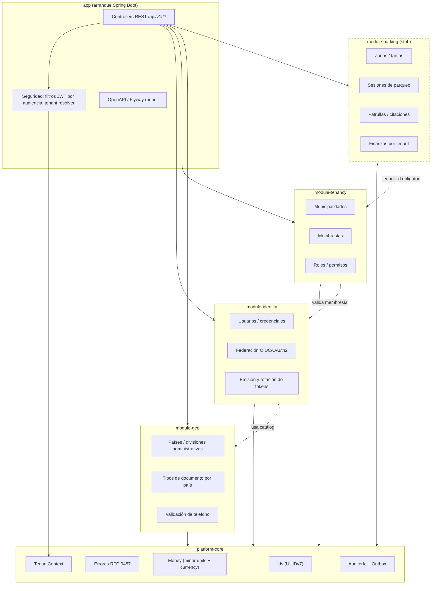

# LupaRX — Arquitectura

> Este documento es descriptivo y depende de `docs/CONTRACT.md` (fuente de verdad normativa del
> dominio, datos y API). Ante cualquier discrepancia, `CONTRACT.md` prevalece.

## 1. Contextos delimitados (bounded contexts)

| Contexto | Responsabilidad | Módulo backend | Independencia de datos |
|---|---|---|---|
| **Geo** | Países, divisiones administrativas (N niveles), tipos de documento por país, formato de teléfono | `module-geo` | Catálogo global, sin `tenant_id` (compartido entre tenants, sólo lectura para el resto) |
| **Identity** | Usuarios globales, credenciales, federación OIDC/OAuth2, tokens | `module-identity` | Entidad global (`users`), sin `tenant_id` propio |
| **Tenancy** | Municipalidades, membresías, roles/permisos, aprobación de acceso | `module-tenancy` | Dueño de `tenant_id`; toda pertenencia a un tenant pasa por aquí |
| **Parking** (stub) | Zonas, tarifas, sesiones de parqueo, patrullas, citaciones, finanzas | `module-parking` | 100% por tenant; frontera declarada desde v0.1 aunque el contenido llegue después |
| **Platform-core** | Kernel compartido: ids (UUIDv7), errores RFC 9457, tipo `Money`, `TenantContext`, auditoría, outbox | `platform-core` | No es un contexto de dominio: es infraestructura transversal que los demás módulos consumen |

### Por qué monolito modular ahora (y no microservicios)

- Un solo equipo, un solo repositorio, una sola base de datos en v0.1–v0.4: el costo operativo de
  microservicios (service mesh, discovery, contratos entre servicios, despliegues coordinados,
  observabilidad distribuida) no se justifica todavía frente al volumen de tráfico esperado.
- Las fronteras de dominio (geo/identity/tenancy/parking) ya están explícitas en el código
  (módulos Maven separados, sin dependencias circulares) — la extracción futura es un cambio de
  *empaquetado y transporte*, no de *diseño*. Ver ADR 0001 y la sección 4 de este documento.
- Un monolito modular permite transacciones ACID entre identidad/tenencia/auditoría en el mismo
  commit (p. ej. aprobar una membresía y escribir el evento de auditoría), algo que en
  microservicios exigiría sagas desde el día uno.
- Se revisita esta decisión cuando exista una razón medible: un módulo con perfil de escalado o
  de despliegue muy distinto al resto (p. ej. `module-parking` con picos de tráfico ciudadano
  independientes de `module-tenancy`), o un segundo equipo que necesite desplegar sin coordinar
  con el resto.

## 2. Diagrama de contenedores (C4 nivel 2) y módulos





Regla de dependencias: `platform-core` no depende de nadie; `module-geo` no depende de `identity`
ni `tenancy`; `module-identity` puede leer `module-geo` (catálogos) pero no `module-tenancy`;
`module-tenancy` puede leer `module-identity` (para validar `user_id`) y `module-geo`;
`module-parking` depende de `tenancy` e `identity` pero ningún otro módulo depende de `parking`.
Esto evita ciclos y es lo que permite extraer módulos en el orden inverso de dependencia.

## 3. Flujo de autenticación por portal

```mermaid
sequenceDiagram
  actor U as Usuario
  participant App as App portal (citizen/admin/inspector)
  participant API as Backend /api/v1/auth/{portal}
  participant DB as PostgreSQL

  U->>App: email + password
  App->>API: POST /auth/{portal}/login
  API->>DB: valida user_credentials (Argon2id) + tenant_memberships
  alt credenciales inválidas
    API-->>App: 401 Problem Details (AUTH_INVALID_CREDENTIALS)
  else credenciales válidas
    API-->>App: 200 {accessToken, refreshToken, expiresIn}
  end
  App->>App: guarda tokens en storage aislado de esta app (ver SECURITY.md)

  Note over App,API: accessToken.aud = luparx:portal:{portal}, tid = tenant activo (nullable)

  U->>App: selecciona otra municipalidad de sus membresías
  App->>API: POST /{portal}/session/tenant {tenantId}
  API->>DB: verifica tenant_memberships(user_id, tenantId, portal, status=ACTIVE)
  API-->>App: 200 {accessToken, refreshToken} con nuevo tid + roles/perms del tenant destino

  Note over API: el refresh anterior se revoca (rotación); reuso de un refresh ya usado invalida toda la familia (family_id)
```

Puntos clave (ver ADR 0004 y ADR 0005):

- El `aud` del JWT identifica el portal (`luparx:portal:citizen|admin|inspector`); el resource
  server rechaza un token cuyo `aud` no coincide con el prefijo de ruta (`/api/v1/{portal}/**`).
- `tid` (tenant activo) es parte del claim; cambiar de municipalidad **siempre** emite un par de
  tokens nuevo, nunca se muta el token en memoria.
- El refresh token es opaco, se guarda hasheado (`token_hash`) y rota en cada uso; el campo
  `family_id` permite detectar reuso (robo de token) y revocar toda la cadena.

## 4. Aislamiento multi-tenant por capa

| Capa | Mecanismo | Detalle |
|---|---|---|
| **Repositorio** | Todo repositorio de una entidad con `tenant_id` recibe el tenant como parámetro obligatorio (no opcional) desde `TenantContext`; no existe un método `findAll()` sin tenant para entidades de tenant | Ver ADR 0002 |
| **Servicio** | Los casos de uso leen el tenant activo de `TenantContext` (resuelto por el filtro de seguridad desde el claim `tid`), nunca de un parámetro de request controlado por el cliente | El cliente no puede pedir datos de un tenant distinto al de su token activo, salvo `PLATFORM_ADMIN` en endpoints explícitamente globales |
| **API / autorización** | Cada endpoint de tenant valida `tenant_memberships(user_id, tenantId, status=ACTIVE)` además del rol; `PLATFORM_ADMIN` es la única excepción explícita y auditada | IDOR/BOLA: el recurso solicitado se valida contra la membresía real, no sólo contra el rol |
| **Background jobs** | Todo job que procese entidades de tenant itera por `tenant_id` explícito y registra el tenant en cada log/métrica; ningún job hace `SELECT *` cruzando tenants sin agregarlo con propósito de plataforma declarado | Jobs de plataforma (p. ej. reportes agregados) están marcados como tales en su nombre y su auditoría |
| **Caché** | Claves de caché siempre incluyen `tenant_id` como parte del key (`tenant:{tenantId}:...`); catálogos globales (geo) usan una partición de caché sin tenant, claramente separada | Nunca se comparte una entrada de caché entre namespace de tenant y namespace global |
| **Exportes** | Todo export (`POST /api/v1/admin/exports`) se genera con el `tenant_id` del contexto de quien lo solicita salvo que sea `PLATFORM_ADMIN` pidiendo un export de plataforma explícito; el archivo resultante lleva el tenant en metadatos | v0.1: CSV síncrono ≤10k filas; ver ADR 0013 para retención |
| **Logs / auditoría** | Logs estructurados llevan `tenantId` (nullable sólo para acciones de plataforma) y `traceId`; `audit_events.tenant_id` es explícito en cada fila | Nunca se agregan logs de distintos tenants en una misma línea o métrica sin agrupar por tenant |

## 5. Extracción futura de módulos a servicios

Cada módulo Maven está diseñado para convertirse en un servicio independiente sin reescritura:

1. **`module-geo`** es el candidato más simple de extraer primero: es de solo lectura para el
   resto del sistema, sin escritura transaccional cruzada con `identity`/`tenancy`. Se convertiría
   en un servicio de catálogo con caché agresiva.
2. **`module-identity`** requeriría exponer sus casos de uso (autenticación, federación) por
   una API interna en lugar de llamada a método Java; el JWT y el JWKS ya están diseñados como
   contrato público, así que el resource server de otros módulos no cambia.
3. **`module-tenancy`** dependería del cliente de `identity` (para `user_id`) vía esa misma API
   interna; sus datos de membresía seguirían siendo la fuente de autorización.
4. **`module-parking`** es el módulo con mayor probabilidad de escalar de forma independiente
   (picos de tráfico ciudadano); su frontera ya excluye cualquier acceso directo a tablas de
   `identity`/`tenancy` — sólo usa los DTOs/eventos que esos módulos publican.

Condición previa a cualquier extracción real: reemplazar las llamadas a método Java entre módulos
por una interfaz explícita (puerto) con su propio DTO, de forma que la extracción sea un cambio de
implementación del adaptador (llamada in-process → llamada HTTP/gRPC) y no un cambio de contrato.
`outbox_events` ya existe desde v0.1 para que la comunicación asíncrona entre módulos no dependa de
memoria compartida ni de un broker todavía no elegido.

## 6. Observabilidad

- **Logs estructurados (JSON)**: cada línea incluye `traceId`, `spanId`, `tenantId` (nullable),
  `userId` (cuando aplica), `portal`, `action`. `traceId` se propaga desde el header
  `X-Request-Id`/`traceparent` de entrada hasta la respuesta y hasta `audit_events`/`outbox_events`
  para poder correlacionar una request con su rastro de auditoría.
- **Métricas**: exposición vía Micrometer/Actuator (`/actuator/prometheus`); métricas etiquetadas
  por `tenant_id` sólo en agregados de bajo cardinality (conteos, latencias por endpoint); nunca se
  usa `tenant_id` de alta cardinalidad como label libre sin agregación (evita explosión de series).
- **Health**: `/actuator/health` con grupos `liveness`/`readiness` (verifican DB y, si aplica, SMTP)
  para que el orquestador de contenedores pueda hacer rolling deploys seguros.
- **Trazas**: preparado para OpenTelemetry (SDK incluido desde `platform-core`), exportador
  configurable por entorno (consola en local, colector externo en producción — sin acoplar el
  código de negocio a un proveedor específico de APM).

## 7. Despliegue y escalado horizontal

- El backend es **stateless**: ninguna decisión de negocio depende de estado en memoria del
  proceso (sesiones, locks, contadores). Rate limiting y bloqueo por intentos usan la tabla
  `auth_attempts` en PostgreSQL (o, cuando el volumen lo justifique, un store compartido tipo
  Redis) en lugar de memoria local — ver ADR 0002 y `SECURITY.md`.
- Múltiples instancias de `app` pueden correr detrás de un balanceador sin afinidad de sesión;
  el JWT es autocontenido y el JWKS se sirve desde cualquier instancia.
- Migraciones Flyway siguen el patrón expand-and-contract (ADR 0010) para permitir despliegues
  rolling sin downtime: una versión nueva del backend nunca requiere que la migración de esquema
  se aplique de forma sincrónica con el arranque de todas las instancias a la vez.
- Escalado: en v0.1–v0.2 una sola instancia de PostgreSQL (con réplica de lectura opcional para
  reportes) es suficiente; el particionamiento de tablas de alto volumen (`audit_events`,
  `parking_sessions` cuando exista) por `tenant_id`/tiempo se evalúa cuando el volumen lo requiera,
  no de forma preventiva.
- Entornos: local (`infra/docker-compose.yml`), y despliegue en contenedores (imagen del backend +
  frontend estático servido detrás de CDN) — sin atarse a un proveedor cloud específico en el
  diseño de la aplicación (variables de entorno para credenciales/endpoints, nunca hardcodeadas).
